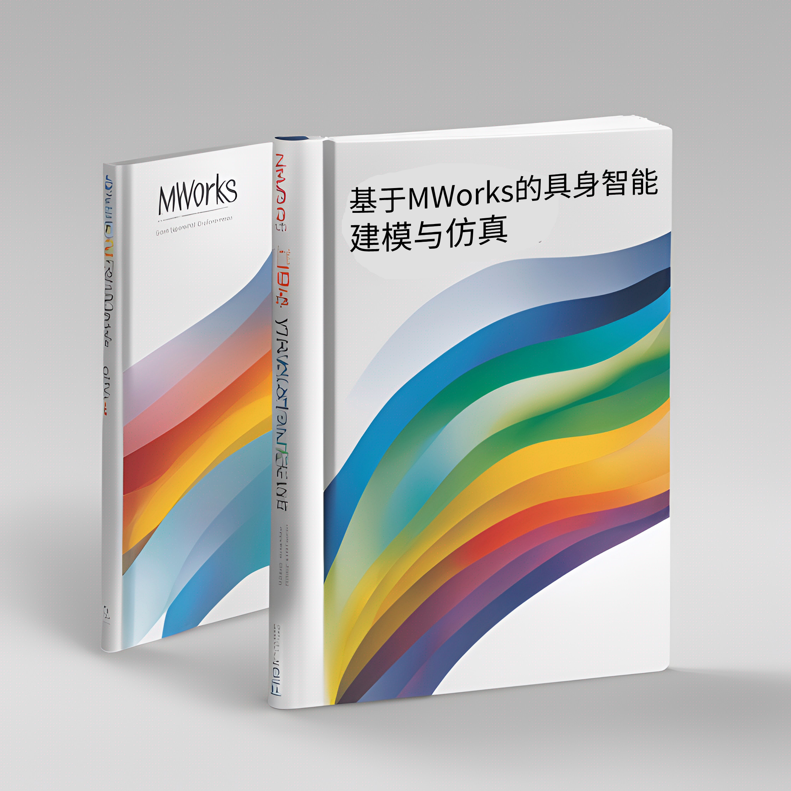

# Embodied-Intelligent-Toolbox

### 内容简介
本书是一本专为工程师、研究人员和学生而写的指南，旨在帮助他们掌握基于MWORKS平台的具身智能建模与仿真技术，以及如何将它们应用于现实世界的问题。书中提供了详细的内容，涵盖了具身智能发展概述、MWORKS平台介绍、无人系统感知与导航算法、智能空间仿真与训练框架，以及具身智能建模与仿真案例等方面；还提供了MWORKS案例，帮助读者将理论知识应用到实际研究中。对具身智能无人系统建模和仿真感兴趣的专业人士，或者是正在学习这一领域的学生，这本书将成为有力的工具和指南。

### 本书定位

目前国内无人系统仿真和训练类课程教材，主要采用MATLAB软件来编写案例程序。由于美国实体制裁政策，近年来部分高校已被禁止使用MATLAB，这对教学实验带来困难，采用开源的仿真和训练环境成为新需求。MWORKS是同元软控全新推出的新一代科学计算和系统建模仿真一体化基础平台，基于高性能科学计算语言Julia和多领域统一建模规范Modelica，MWORKS为科研和工程计算人员提供了交互式科学计算和建模仿真环境，实现了科学计算环境Syslab与系统建模仿真环境Sysplorer的双向融合，可满足各行业在设计、建模、仿真、分析、优化等方面的业务需求。Julia是一门科学计算语言，是开源的、动态的计算语言，具备了建模语言的表现力和开发语言的高性能两种特性，与系统建模和数字孪生技术紧密融合，是最适合构建信息物理系统（Cyber Physical System，CPS）的计算语言。MWORKS.Syslab 是新一代科学计算环境，旨在为算法开发、数值计算、数据分析和可视化、信息域计算分析等提供通用编程开发环境。Syslab 基于新一代高性能科学计算语言 Julia，提供业内最为高效的数值计算能力，同时兼容 Python 和 M 语言，支持与 Python、C/C++、Fortran、M、R 等编程语言的相互调用。结合其丰富的专业工具箱，Syslab 可支持不同领域的计算应用如信号处理、通信仿真、图形图像处理、控制系统设计分析、人工智能等。
基于MWORKS的具身智能建模与仿真参考了MATLAB机器人与自主系统系列工具箱的体系架构及其函数和案例组织方式，整理编写基于MWorks的具身智能建模与仿真工具箱实例，满足建模仿真类课程教学实验需求。

### 本书内容涵盖

**具身智能概述:**介绍具身智能的发展历程、关键技术，包括具身机器人、具身仿真平台、具身感知、具身交互和具身智能体等；
**MWORKS系统建模与仿真基础：**深入介绍MWORKS平台的设计理念、构成、行业应用，以及系统建模仿真环境Sysplorer、控制策略建模环境Sysblock和科学计算环境Syslab等；
**无人系统感知与导航算法：**介绍无人系统（机械臂、无人车、无人船、无人机）的感知识别算法、导航避障算法、集群控制算法和综合决策算法等；
**智能空间仿真与训练框架：**介绍智能空间框架、ROS通信协议、Unity虚拟环境、MWORKS物理仿真引擎、AI算法接口和仿真训练流程等；
**具身智能建模与仿真案例：**提供机械臂、无人车、无人船、无人机和无人集群等案例，帮助读者将理论知识应用到实际研究中。
### 本书特色
理论与实践相结合：不仅介绍理论知识，还提供MWORKS案例，帮助读者将理论知识应用到实际研究中。
内容全面：涵盖具身智能建模与仿真相关的各个方面，帮助读者全面掌握相关技术。
案例丰富：提供多种具身智能建模与仿真案例，帮助读者更好地理解和应用相关技术。
本书目标读者：对具身智能建模与仿真感兴趣的专业人士，正在学习和研究具身智能的学生，工程师和研究人员。本书将成为读者在具身智能建模与仿真领域取得实际成就的有力工具和指南。

### 本书目录
[基于MWORKS的具身智能建模与仿真	](#_Toc7810 )

[第一章 具身智能概述	](#_Toc17625 )

[1.1. 具身智能发展概述	](#_Toc29713 )

[1.2. 具身机器人	](#_Toc5917 )

[1.3. 具身仿真平台	](#_Toc5519 )

[1.4. 具身感知	](#_Toc13922 )

[1.5. 具身交互	](#_Toc18083 )

[1.6. 具身智能体	](#_Toc10280 )

[第二章 MWORKS系统建模与仿真基础	](#_Toc19824 )

[2.1. MWORKS 平台介绍	](#_Toc15874 )

[2.1.1. 平台设计理念	](#_Toc20793 )

[2.1.2. 平台构成	](#_Toc5693 )

[2.1.3. 行业应用	](#_Toc739 )

[2.2. 系统建模仿真环境 MWORKS.Sysplorer	](#_Toc8909 )

[2.2.1. 系统建模环境	](#_Toc1708 )

[2.2.2. 模型	](#_Toc28840 )

[2.2.3. 模型仿真	](#_Toc4253 )

[2.2.4. 后处理	](#_Toc31476 )

[2.2.5. 物理模型的代码生成	](#_Toc29051 )

[2.2.6. 自动化脚本建模	](#_Toc28855 )

[2.3. 控制策略建模环境 MWORKS.Sysblock	](#_Toc62 )

[2.3.1. 控制算法建模	](#_Toc18662 )

[2.3.2. 状态机建模	](#_Toc27746 )

[2.3.3. 数据字典	](#_Toc8198 )

[2.3.4. 信号源	](#_Toc10116 )

[2.3.5. 常用控制算法	](#_Toc29627 )

[2.3.6. 嵌入式代码生成	](#_Toc18734 )

[2.4. 科学计算环境 MWORKS.Syslab	](#_Toc13311 )

[2.4.1. 交互式编程环境	](#_Toc9663 )

[2.4.2. 解释与调试	](#_Toc7891 )

[2.4.3. 函数库	](#_Toc22991 )

[2.4.4. 图形可视化	](#_Toc17058 )

[2.5. Sysplorer 双向集成	](#_Toc21893 )

[2.5.1. 工具箱	](#_Toc9402 )

[2.5.2. 信号与通信设计工具	](#_Toc4015 )

[2.5.3. 设计检查工具	](#_Toc13442 )

[2.5.4. 半物理仿真工具	](#_Toc1702 )

[第三章 无人系统感知与导航算法	](#_Toc14671 )

[3.1. 无人系统概述	](#_Toc9538 )

[3.1.1. 机械臂	](#_Toc6160 )

[3.1.2. 无人车	](#_Toc5218 )

[3.1.3. 无人船	](#_Toc30502 )

[3.1.4. 无人机	](#_Toc1503 )

[3.2. 感知识别算法	](#_Toc14876 )

[3.3. 导航避障算法	](#_Toc11226 )

[3.4. 集群控制算法	](#_Toc23594 )

[3.5. 综合决策算法	](#_Toc26574 )

[第四章 智能空间仿真与训练框架	](#_Toc10137 )

[4.1. 智能空间框架	](#_Toc22213 )

[4.2. ROS通信协议	](#_Toc31111 )

[4.3. Unity虚拟环境	](#_Toc19618 )

[4.4. MWORKS物理仿真引擎	](#_Toc31905 )

[4.5. AI 算法接口	](#_Toc7780 )

[4.6. 仿真训练流程	](#_Toc23239 )

[第五章 具身智能建模与仿真案例	](#_Toc23496 )

[5.1. 机械臂案例	](#_Toc9401 )

[5.2. 无人车案例	](#_Toc23224 )

[5.3. 无人船案例	](#_Toc26682 )

[5.4. 无人机案例	](#_Toc19297 )

[5.5. 无人集群案例	](#_Toc28757 )